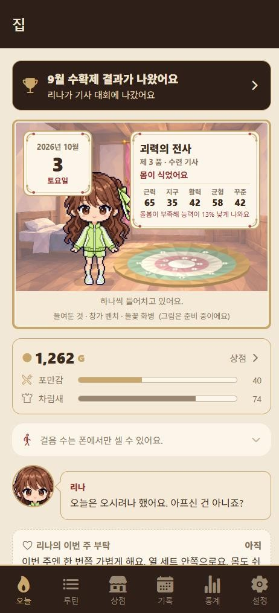
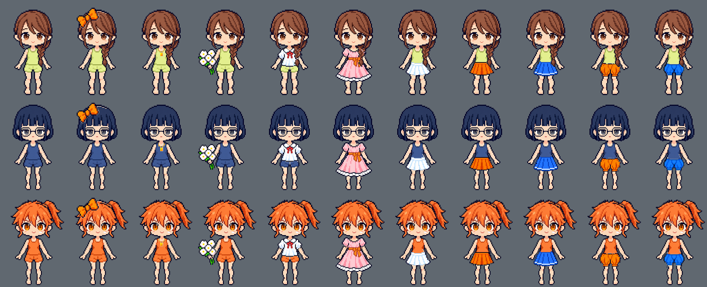

# Refit

운동 기록 앱이자 아이를 키우는 게임이다. 운동하면 골드를 벌고, 그 골드로 아이를 먹이고 입히고 가르치고 방을 꾸민다. Expo(React Native)와 Supabase로 만들었다.



목표는 쓰는 사람의 수다. 돈 받는 기능과 광고는 없다. 방향과 짓는 순서는 [docs/direction.md](docs/direction.md)에, 왜 그렇게 되어 있는지는 [NOTES.md](NOTES.md)에 적었다.

## 무엇을 하는가

**운동 기록**

- 기본 종목 159개. 초성으로 찾고, 없는 종목은 찾던 이름 그대로 바로 만든다.
- 세트마다 무게, 횟수, 몇 개 더 할 수 있었는지(RPE)를 적는다. 워밍업 세트와 좌우 따로 적기를 지원한다.
- 다음에 올릴 무게를 권한다. 워밍업은 40 · 60 · 80% 무게로 권하고, 누르기 전에는 넣지 않는다.
- 종목 둘이나 셋을 묶어 번갈아 한다(슈퍼세트). 묶음 안에서는 쉬는 시간이 뜨지 않는다.
- 바벨 종목은 한쪽에 끼울 원판을 무거운 것부터 적어 준다.
- 신호가 끊겨도 기록을 버리지 않는다. 못 보낸 쓰기는 줄에 세워 두고, 앱을 껐다 켜도 남는다.
- 기록을 CSV와 JSON으로 내보내고 다시 가져온다.

**아이**

- 아이는 셋이다. 리나는 자상하고, 유키는 엄격하고, 피아는 승부욕이 강하다. 셋이 눈여겨보는 기록이 달라 같은 날에도 다른 말을 한다.
- 운동마다 아이가 일기를 한 줄 쓴다. 함께한 날이 쌓이면 사이가 가까워지고 기억이 남는다.
- 옷과 장신구 10가지, 가구, 끼니, 수업을 골드로 산다. 옷과 가구는 하루에 하나만 선물할 수 있다.
- 새 집은 150G로 시작하고, 세트 하나짜리 운동도 78G를 번다. 가장 싼 선물인 머리 리본이 150G라 첫 운동을 마친 날 바로 선물할 수 있다.
- 매달 마지막 토요일에 축제가 열린다. 지어낸 맞수 셋과 겨루고, 최근 4주에 운동한 날이 가장 큰 몫을 차지한다.
- 운동을 쉬어도 아이는 토라지지 않는다. 순위표도 없다.



## 처음 한 번만

1. Supabase 프로젝트를 만들고 **SQL Editor**에서 아래 파일을 차례로 실행한다. 모두 여러 번 실행해도 된다.

   | 차례 | 파일 | 하는 일 |
   |---|---|---|
   | 1 | `supabase/schema.sql` | 테이블과 RLS 정책 |
   | 2 | `supabase/migrate.sql` | 나중에 더해진 칸 |
   | 3 | `supabase/admin.sql` | 관리자, 운동 요청, 프로필 |
   | 4 | `supabase/social.sql` | 친구, 선물, 함께 운동 보너스 |
   | 5 | `supabase/relay.sql` | 조언 중계 (쓸 때만) |
   | 6 | `supabase/account.sql` | 앱 안에서 계정 지우기 |

2. 프로젝트 루트에 `.env`를 만들고 값을 채운다(`.env.example` 참고). `.env`는 git에 올라가지 않는다.
   - `EXPO_PUBLIC_SUPABASE_URL` — Project Settings → Data API의 URL (`/rest/v1/` 제외)
   - `EXPO_PUBLIC_SUPABASE_ANON_KEY` — Project Settings → API Keys의 anon/publishable 키
3. 의존성을 설치한다.

   ```bash
   npm install
   ```

4. 앱에 로그인한 뒤 **설정 탭 → 기본 종목 불러오기 · 정보 새로 고치기**를 한 번 누른다. 종목 159개가 기구, 근육, 하는 법과 함께 채워진다. SQL을 다시 실행했거나 종목이 늘었을 때도 한 번 더 누른다. 이미 채워진 값은 건드리지 않는다.
5. 비밀번호 찾기를 쓰려면 Supabase의 메일 틀에 `supabase/templates/reset-password.html`을 붙여 넣는다. 6자리 코드를 보내는 틀이다.

## 실행

```bash
npx expo start
```

- **웹**: 브라우저로 http://localhost:8081 을 연다. 화면을 고치고 확인하기엔 이쪽이 가장 빠르다.
- **아이폰**: Expo Go를 설치하고 카메라로 QR을 찍는다. PC와 같은 Wi-Fi여야 한다.
  - Expo Go에 로그인돼 있으면 PC의 CLI도 같은 계정이어야 열린다. 한쪽만 로그인된 상태면 Expo Go에서 로그아웃한다.
  - 폰이 서버에 못 닿으면 아이폰 **설정 → 앱 → Expo Go → 로컬 네트워크**를 확인한다.

웹에서만 다르게 도는 것이 있다. `Alert`는 아무 일도 하지 않고(`lib/confirm.ts`가 대신한다), 숫자 자판, 햅틱, 걸음 수, 안전 영역은 폰에서만 드러난다.

## 웹으로 배포

`master`에 푸시하면 GitHub Actions(`.github/workflows/pages.yml`)가 시험 3종 가운데 둘(시험, 타입)을
돌리고 웹판을 빌드해 GitHub Pages에 올린다. 주소는 `https://<계정>.github.io/refit/`이다.

저장소 설정에서 한 번만 해 둘 것 두 가지.

1. Settings → Pages → Source를 「GitHub Actions」로 고른다.
2. Settings → Secrets and variables → Actions → Variables 탭의 「Repository variables」에 `EXPO_PUBLIC_SUPABASE_URL`과
   `EXPO_PUBLIC_SUPABASE_ANON_KEY`를 넣는다. 둘 다 공개되어도 되는 값이라 Secrets가 아니라
   Variables에 둔다.

웹판에서는 알림, 걸음 수, 헬스 커넥트가 되지 않는다.

## AI 조언 (선택)

운동을 마치면 아이가 조언을 한마디 한다. 모델이 없으면 규칙으로 지은 조언이 나오므로 설정하지 않아도 된다. 모델의 답에 든 숫자가 넘겨준 기록 안에 없으면 그 답은 버리고 규칙의 답을 쓴다.

**PC의 Ollama에 직접 묻기** — `.env`에 적는다. 폰에서 쓰려면 `localhost` 대신 PC의 LAN IP를 적는다.

```
EXPO_PUBLIC_ADVICE_URL=http://localhost:11434/api/generate
EXPO_PUBLIC_ADVICE_MODEL=qwen3.8:27b
```

**중계로 묻기** — 집 밖의 폰이나 남의 폰은 PC에 닿지 못한다. 폰이 Supabase에 물음을 적으면 PC의 일꾼이 가져가 답을 적는다. `supabase/relay.sql`을 실행하고, `relay/.env`에 URL과 service-role 키를 넣은 뒤 일꾼을 띄운다. 켜는 법은 [docs/relay.md](docs/relay.md)에 있다.

```bash
node --env-file=relay/.env relay/worker.mjs
```

일꾼은 1분마다 살아 있다고 적는다. 그 표시가 2분 넘게 끊기면 폰은 기다리지 않고 예전처럼 돈다. service-role 키는 `relay/.env`에만 두고 앱에는 넣지 않는다.

## 구조

- `app/` — Expo Router 화면. `(tabs)/`가 아래 탭 여섯(오늘 · 루틴 · 상점 · 기록 · 통계 · 설정), `workout/[id]`가 운동 중, `summary/[id]`가 마친 뒤, `settings/`가 종목 · 백업 · 요청 · 계획 · 아이 고르기, `festival`이 축제, `memories`가 함께한 날들, `friends`가 친구다.
- `lib/` — 규칙이 사는 곳. 화면과 DB 없이 Node만으로 시험한다. 다음에 올릴 무게(`progress.ts`), 못 보낸 쓰기(`outbox.ts`), 골드와 상점(`economy.ts`, `shop.ts`), 아이의 말과 일기(`voices.ts`, `diary.ts`), 축제(`festival.ts`), 조언(`advice.ts`)이 여기 있다.
- `lib/db.ts` — Supabase 질의 전부. 화면은 이 함수들만 부른다.
- `components/` — `PaperDoll`(아이와 입은 옷을 겹쳐 그린다), `TrainingHall`(방), `ShopShelves`(상점), `SetCard`(세트 입력) 등.
- `assets/girls/`, `assets/garments/` — 아이 셋과 옷 열 가지의 도트 그림. 아이는 몸 · 아래옷 · 신발 · 윗옷 · 머리 다섯 장으로 나뉘어 있고, 선물한 옷은 제 옷과 머리 사이에 겹친다.
- `supabase/` — SQL. 모든 줄은 `auth.uid()`에 매여 본인 것만 보인다.
- `relay/worker.mjs` — 조언 중계의 일꾼.
- `public/admin.html` — 관리자 페이지. `/admin.html`로 연다.
- `scripts/` — 그림을 주문하고 앱에 넣는 도구. 쓰는 법은 [docs/art-order.md](docs/art-order.md)에 있다.
- `patches/` — `react-native-body-highlighter`가 SVG에 붙이던 잘못된 prop을 걷어낸다. `npm install` 때 저절로 적용된다.

## 그림

아이와 옷은 ChatGPT의 이미지 생성으로 받는다. 몸틀 한 장을 먼저 정하고, 그 몸틀을 참고 그림으로 넣어 아이와 옷을 같은 자리에 그리게 한다. 받은 그림에서 머리와 옷을 떼어 내는 일은 `scripts/`가 한다. 모든 아이와 옷이 64 × 96점짜리 한 캔버스를 쓰므로, 옷 한 벌을 그리면 세 아이가 모두 입는다.

## 검사

```bash
node --test lib/*.test.ts
```

```bash
npx tsc --noEmit
```

```bash
npx eslint .
```

시험은 704건이고 DB도 모델도 필요 없다. 개발 서버가 200을 돌려주는 것은 묶음이 지어진다는 뜻이지 앱이 돈다는 뜻이 아니다. 새 탭을 열어 콘솔을 본다.

## 라이선스

세 부분으로 나뉜다. 자세한 것은 [LICENSE](LICENSE)에 있다.

- 코드는 MIT 라이선스다.
- 아이 셋(리나 · 유키 · 피아)과 옷, 장신구, 방, 가구의 그림은 권리를 유보한다. 여기서 볼 수는 있으나 허락 없이 복사하거나 고치거나 다른 작업에 쓸 수 없다. 코드를 가져다 쓰는 사람은 그림을 제 것으로 바꿔야 한다.
- Expo 틀에서 온 기본 아이콘과 설정 일부는 Expo의 MIT 라이선스를 따른다.
